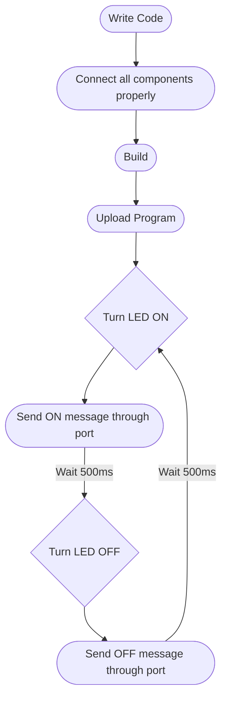
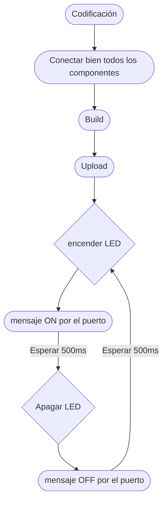

# Practice 1: LED Blink with ESP32 (English Version)
## Materials
- ESP32
- LED
- 470-ohm resistor

## Introduction

This practice uses PlatformIO to program an ESP32. The objective is to understand the `setup()` function, which initializes the LED, and the `loop()` function, which creates an infinite cycle that turns the LED on and off, producing a blinking effect.

## Code Explanation
```cpp
#include <Arduino.h>

// connect the LED to pin 13
int led = 13;

void setup() {
  // initialize the pin as OUTPUT
  pinMode(led, OUTPUT); 
}

void loop() {
  digitalWrite(led, HIGH);   // turn the LED on: HIGH means voltage applied
  delay(500);                // wait 500ms
  digitalWrite(led, LOW);    // turn the LED off: LOW means no voltage
  delay(1000);               // wait another 1000ms
}
// This creates an infinite loop of turning the LED on and off, like blinking.
```
### Flowchart


### Timing Diagram


## How to Run

1. **Install PlatformIO**
    - Install [VS Code](https://code.visualstudio.com/)
    - Install the [PlatformIO extension](https://platformio.org/install/ide?install=vscode)

2. **Create a New Project**
    - Open PlatformIO in VS Code
    - Create a new project and select your board (e.g., ESP32 Dev Module)
    - Choose **Arduino framework**

3. **Add the Code**
    - Replace the contents of `src/main.cpp` with the code provided above

4. **Connect the Hardware**
    - Connect the LED to **GPIO 13** with a 470-ohm resistor in series
    - Connect the ESP32 board to your computer via USB

5. **Build and Upload**

    - Click the **Build (✓)** button to compile the code
    - Click the **Upload (→)** button to flash the code to your ESP32

6. **Observe the Result**
    - The LED should blink: **ON for 500ms, OFF for 1000ms** in an infinite loop


# Práctica 1: Parpadeo de LED con ESP32 (Versión en Español)

## Materiales
- ESP32
- LED
- resistencia de 470ohms

## Introducción

Esta práctica utiliza PlatformIO para programar un ESP32. El objetivo es comprender la función `setup()`, que inicializa el LED, y la función `loop()`, que crea un ciclo infinito que enciende y apaga el LED, produciendo un efecto de parpadeo.


## Explicación del código (con comentarios que explican el funcionamiento línea a línea): 
```cpp
#include <Arduino.h>

//conecta el led 13 al pin 13
int led = 13;
void setup() {
  // inicializa el pin como OUTPUT
  pinMode(led, OUTPUT); 
}

void loop() {
 digitalWrite(led, HIGH);   // enciende el LED: HIGH, se refiere al voltaje
  delay(500);               // y espera 500ms
  digitalWrite(led, LOW);    // apaga el LED : off, voltaje en LOW
  delay(1000);               // y espera otros 1000ms
}
//de esta manera lo que se provoca es un bucle infinito de encender y apagar LEDs, algo así como un parpadeo.
```
### Diagrama de flujos


### Diagrama de tiempos


## Cómo Ejecutar  

1. **Instalar PlatformIO**  
   - Instala [VS Code](https://code.visualstudio.com/)  
   - Instala la [extensión PlatformIO](https://platformio.org/install/ide?install=vscode)  

2. **Crear un Nuevo Proyecto**  
   - Abre PlatformIO en VS Code  
   - Crea un nuevo proyecto y selecciona tu placa (ejemplo: ESP32 Dev Module)  
   - Elige el **framework Arduino**  

3. **Agregar el Código**  
   - Reemplaza el contenido de `src/main.cpp` con el código proporcionado arriba  

4. **Conectar el Hardware**  
   - Conecta el LED al **GPIO 13** con una resistencia de 470 ohms en serie  
   - Conecta la placa ESP32 a tu computadora mediante USB  

5. **Compilar y Subir**  
   - Haz clic en el botón **Build (✓)** para compilar el código  
   - Haz clic en el botón **Upload (→)** para cargar el código en tu ESP32  

6. **Observar el Resultado**  
   - El LED debería parpadear: **ENCENDIDO por 500ms, APAGADO por 1000ms** en un bucle infinito  


### Recursos
- Video explicativo en español sobre las conexiones del LED y la resistencia: [Ver video](assets/practica1_video.mp4)