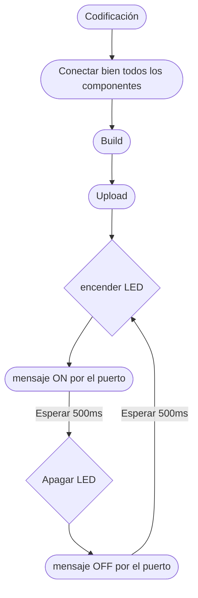

# Práctica 1

## MATERIALES
- ESP32
- LED
- resistencia de 470ohms

## Presentación:
En esta práctica usamos el Plataform.io, he entendido el setup para incializar el LED y el bucle: void loop() que provoca que el LED se encienda y apague.

## Explicación del código: 
```
#include <Arduino.h>

//conecta el led 13 al pin 13
int led = 13;
void setup() {
  // inicializa el pin como OUTPUT
  pinMode(led, OUTPUT); 
}

void loop() {
 digitalWrite(led, HIGH);   // enciende el LED: HIGH, se refiere al voltaje
  delay(500);               // y espera 500ms
  digitalWrite(led, LOW);    // apaga el LED : off, voltaje en LOW
  delay(1000);               // y espera otros 1000ms
}
//de esta manera lo que se provoca es un bucle infinito de encender y apagar LEDs, algo así como un parpadeo.
```
Diagrama de flujos


Diagrama de tiempos


