#include <Arduino.h>

// Pin 13 has an LED connected on most Arduino boards.
// give it a name:
int led = 13;
void setup() {
  // initialize the digital pin as an output.
  pinMode(led, OUTPUT); 
}

void loop() {
 digitalWrite(led, HIGH);   // turn the LED on (HIGH is the voltage level)
  delay(500);               // wait for a 500ms
  digitalWrite(led, LOW);    // turn the LED off by making the voltage LOW
  delay(1000);               // wait for a 500ms
}

Diagrama de flujos

```mermaid
flowchart TD
 id1([Codificación])
 id2([Build])
 id3([Conectar bien todos los componentes])
 id4([mensaje ON por el puerto])
  id5([mensaje OFF por el puerto])
   id7{encender LED}
    id8{Apagar LED}
 id6([Upload])
id1-->id3;
id3-->id2;
id2-->id6;
id6-->id7;
id7-->id4;
id4-->|Esperar 500ms|id8;
id8-->id5;
id5-->|Esperar 500ms|id7;
```

Diagrama de tiempos

